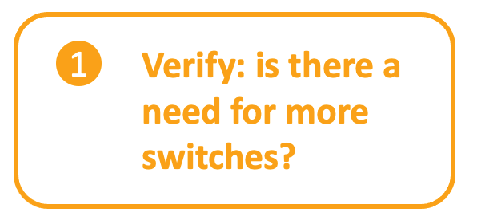

# LET'S START OUR PROGRAMMABILITY JOURNEY TOGETHER!
In this repository we are sharing all code that has been presented during the breakout session BRKEMT-2015 at Cisco Live 2021. The main goal with these scripts is to introduce Network Engineers to the power and possibilities of programmability by providing some simple examples.

**Content to be added closer to the event.**


## Getting Started
All of the code presented in the Cisco Live session is available for you on this Github repository. If you do not have programming experience before hand, there are couple of steps you will need to cover before you can start trying the examples out.

### Prepare your developer environment
- Install Python version 3
- Install Git
- Install Postman
- Install a code editor, for example Atom or VS Code

Not sure how to do these? DevNet has great learning material to get you through these steps. You will need **a free DevNet account** to access the material, so register if you haven't, and enjoy the learning labs to get your developer environment started:
- Windows: https://developer.cisco.com/learning/devnet-express/dnav4-track/dev-setup/dev-win/step/1
- Mac: https://developer.cisco.com/learning/devnet-express/dnav4-track/dev-setup/dev-mac/step/1
- Linux (CentOS): https://developer.cisco.com/learning/devnet-express/dnav4-track/dev-setup/dev-centos/step/1
- Linux (Ubuntu): https://developer.cisco.com/learning/devnet-express/dnav4-track/dev-setup/dev-ubuntu/step/1

### Find your Cisco equipment to test against

To be able to test the code, you will need to have something to test it against with. You can either utilise your own equipment, or try using the code against **DevNet Sandboxes**. The part 1 codes would require one or more IOS XE switches, and the part 2 would require a Cisco DNA Center. All of the code examples presented in this session require read-only access.
- Cisco DevNet sandboxes: https://devnetsandbox.cisco.com/


### Clone the repository and install required libraries

When you have your developer environment up and running, make sure you install all libraries and modules required for your scripts. To keep your devveloper environment tidy, make sure to activate your *virtual environment* before installing the libraries.

Clone this repository to the environment in which your are working:

```
git clone https://github.com/BRKEMT2015/code.git
```

Install the requirements to have all the necessary libraries for the code examples to work.
```
pip install -r requirements.txt 
```

## Use cases

[](/port_utilisation)
[](/swim)

## Authors & Maintainers

People responsible for the creation and maintenance of this project:

- Christina Skoglund cskoglun@cisco.com
- Juulia Santala jusantal@cisco.com

## License

TBD