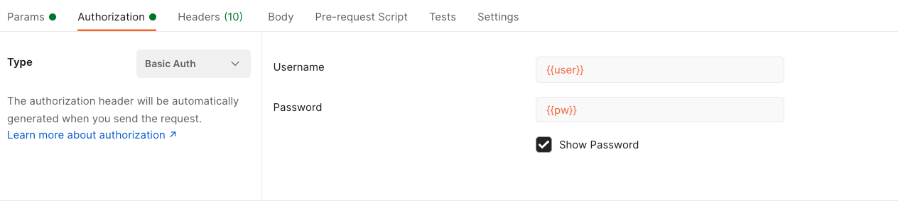
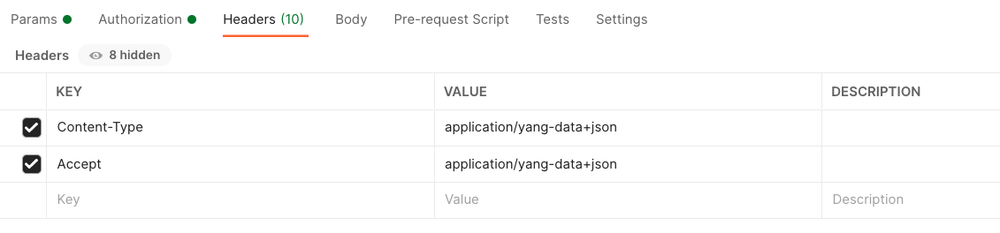
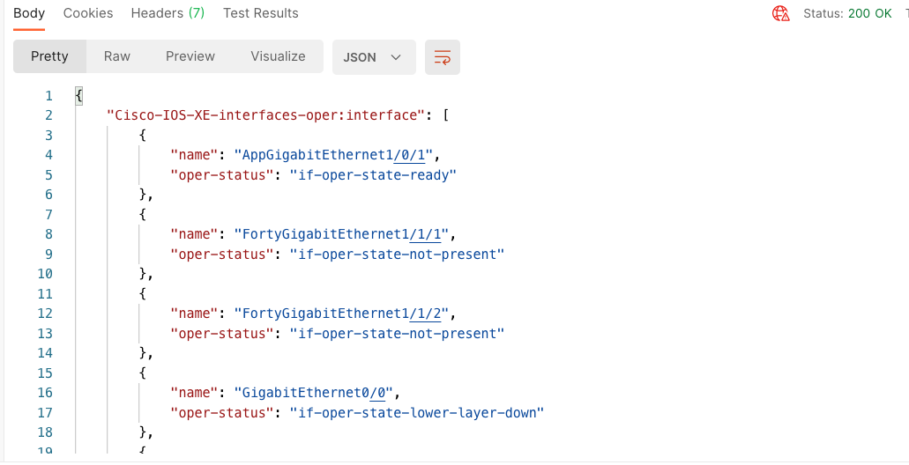

# USE CASE 1: Is there a need for more switches?


In this use case Antti needs to check the port utilisation of his network in order to verify whether he needs more switches or if there is already enough ports for future needs. For this we are using **Model Driven Programmability** with **Cisco IOS XE** switches. Our focus is on **RESTCONF** and **YANG models**.

## Getting Started
- Make sure you have installed the **requirements.txt** to have all the required libraries in your development environment
- Select which IOS XE device(s) you want to work with. Good option is to work with the IOS XE sandbox in the [DevNet Sandbox](https://devnetsandbox.cisco.com/)

## Using POSTMAN with RESTCONF and an IOS XE switch

First thing that we should do when learning to use a new API ist to test it to see how it works and what kind of response we get. [Postman](https://www.postman.com/) is a great tool for this! Lets see how we would navigate and find the correct RESTCONF settings for getting the information about the switch ports.

We recognised that there is a YANG model [Cisco-IOS-XE-interfaces-oper](https://github.com/YangModels/yang/blob/master/vendor/cisco/xe/1741/Cisco-IOS-XE-interfaces-oper.yang) that provides us with the correct information. By using the tool [pyang](https://github.com/mbj4668/pyang) we can nicely visualize the YANG model's content.

```
$ pyang -f tree Cisco-IOS-XE-interfaces-oper.yang
module: Cisco-IOS-XE-interfaces-oper
  +--ro interfaces
  |  +--ro interface* [name]
  |     +--ro name                            string
  |     +--ro interface-type?                 interfaces-ios-xe-oper:ietf-intf-type
  |     +--ro admin-status?                   interfaces-ios-xe-oper:intf-state
  |     +--ro oper-status?                    interfaces-ios-xe-oper:oper-state
  |     +--ro last-change?                    yang:date-and-time
  |     +--ro if-index?                       int32
  |     +--ro phys-address?                   yang:mac-address
  |     +--ro higher-layer-if*                string
  |     +--ro lower-layer-if*                 string
  |     +--ro speed?                          uint64
  |     +--ro statistics
<... output omitted ...>
```

Based on this, we can start constructing the url for our RESTCONF API call. This is how we will do it:
```
https://<address>/<root>/<data store>/<YANG module:Container>/<leaf>[?<options>]
```

In this case, following the pyang output we have above:
- **address**: the address of your switch including the restconf port (defaults to 443)
- **root**: *restconf*
- **data store**: *data*
- **YANG module**: *Cisco-IOS-XE-interfaces-oper*
- **container**: *interfaces*
- **leaf**: *interfaces*
- **options**: when first trying this out, leave these out to see the full response that you get. You will notice that there is quite a lot of information, so focusing on the main areas (the name of the interface and the operative status) makes sense, therefor we would have here *fields=name;oper-status*

Full URL would then be:
```
https://<address>:<port>/restconf/data/Cisco-IOS-XE-interfaces-oper:interfaces/interface?fields=name;oper-status
```

1. Lets use this is Postman as the request url:

Notice that we are getting information, therefor the method should be **get**.
Please note that you should use your switch address in the place of {{ip}} and your restconf port in the place of {{port}}. Restconf default port is 443.


2. We also need to define the authorization, as only authorized persons should have access to our network information:

We use *basic auth* for the authorization with the switch username and password. Please note that you should put in the place of {{user}} your switch username and in the place of {{pw}} your switch password.


3. We need also headers for our call:

Here we define the content-type in which we are communicating with the switch.


4. After the previous sections are filled, we can send our request, and will receive an response:

Note how the status is 200 OK, meaning that our request was successful. We have the information of the switch's interfaces in JSON format, which is easy to manage in Python.


**Now that we know how we can send a request using RESTCONF and YANG models, we can do the same in a script!**

## A script to verify port utilisation of one switch

> Note! Check that you have installed the requirements.txt from the root of this repository, so that you have the required libraries installed for the code to work.

Lets utilise Python to automate what we just did with Postman! An example code for testing the port utilisation of one switch can be found from the file [port_utilisation_one_switch.py](port_utilisation_one_switch.py).
**Before running the code, please update the information on lines 33-35 with your switch details:**
```Python
switch = {
    "IP": "0.0.0.0", #Your switch address here
    "USER": "admin", #Your switch username here
    "PW": "password" #Your switch password here
}
```

**IF your switch uses other port for RESTCONF than the default 443, please update that information on line 84:**
```Python
    switch_utilisation = get_switch_if_utilisation(switch["IP"], switch["USER"], switch["PW"], rc_port=<YOUR PORT NUMBER>)
```

After doing these changes, you can run the script in your terminal:
```
python port_utilisation_one_switch.py
```

Once you have verified what the code prints out, go and check rest of the code, and try to understand how it works!

## A script to verify port utilisation of all the switches

> Note! Check that you have installed the requirements.txt from the root of this repository, so that you have the required libraries installed for the code to work.

Checking the port utilisation from one switch is not really much of automation yet, but when we do this for many switches, we are off loading a lot of manual work. An example code for testing the port utilisation of many switches can be found from the file [port_utilisation_many_switches.py](port_utilisation_many_switches.py).

This example utilises a CSV file to get the credentials of all the switches. So start by opening the [credentials.csv](credentials.csv) file and filling in all the switches that you want to include in the port utilisation check:

```
IP,USER,PW
10.10.10.1,admin,password #replace with your switch details
10.10.10.2,admin,password #replace with your switch details
10.10.10.3,admin,password #replace with your switch details
10.10.10.4,admin,password #replace with your switch details
```

You can add as many switches as you want. After adding your switches, you can run the script in your terminal:
```
python port_utilisation_many_switches.py
``` 

If you check the code, you will see that there is a lot similarity to the code where we checked port utilisation of one switch: now we just do the some action to as many switches as we have in the credentials.csv file.