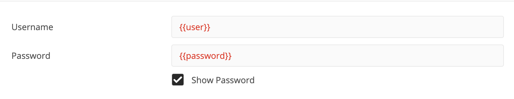
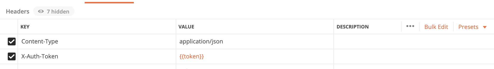

# USE CASE 2: Are all the network switvhes in correct software version?


In this use case Antti needs to check the software version that each of his devices in his network are running, to ensure that they are running on a safe version. This time however, Antti will programming against a controller, Cisco DNA Center, and leverage the already collected and structured data of the devices that DNA Center has to offer. 

## Getting Started
- Make sure you have installed the requirements.txt to have all the required libraries in your development environment
- Select which Cisco DNA Center you want to work with. Good option is to work with the Cisco DNA Center sandbox in the [DevNet Sandbox](https://devnetsandbox.cisco.com/)

## Using POSTMAN with Cisco DNA Center APIs

First thing that we should do when learning to use a new API is to test it to see how it works and what kind of response we get. [Postman](https://www.postman.com/) is a great tool for this! Lets see how we would navigate and find the correct REST APIs of DNA Center to work with.

In order to be able to work with the Cisco DNA Center APIs, Antti needs to use an Authentication Token. This token is retrieved by using the Authentication API. Tha is where Antti will start. 

1. Lets use this in Postman as the request url in order to retrieve the Authentication Token:

Notice that we are posting information, therefor the method should be **POST**.
Please note that you should use your Cisco DNA Center URL or IP address in the place of {{baseurl}}. 

2. In order to receive the Authentication Token, Antti will need to get proper authorization by the controller:

We use *basic auth* for the authorization with the Cisco DNA Center username and password. Please note that you should put in the place of {{user}} your switch username and in the place of {{password}} your switch password.

3. After the previous sections are filled, we can send our request, and will receive an response:

Note how the status is 200 OK, meaning that our request was successful. We have gotten the token in JSON format. 

4. Now we need to retrieve device information by using the Device List API:

Just as in step 1, we add the url of the API but this time we will retrieve data, therefore the method should be **GET**.
Please note that you should use your Cisco DNA Center URL or IP address in the place of {{baseurl}}. 

5. We need also headers for our call:

Note how we are using the token that we retrieved in step 1-3, in order to make this REST API call to the Cisco DNA Center. 

6. After the previous sections are filled, we can send our request, and will receive an response:

Note how the status is 200 OK, meaning that our request was successful. We have gotten the device data in JSON format. 

## A script to verify the software version of the network devices

> Note! Check that you have installed the requirements.txt from the root of this repository, so that you have the required libraries installed for the code to work.

Lets utilise Python to automate what we just did with Postman! An example code for finding and exporting SW data of one device can be found in the file [swim.py](swim.py).

**Please not that this code is communicating to DevNet Sandbox. If you want to try it out against your own system you need to update the base url and credentials**
**Make sure you have an empty Excel document named ***document.xlsx*** in the same directory as your code is located**

You execute the code by:
```
python swim.py
````

## A script utilising Cisco DNA Center SDK

> Note! Check that you have installed the requirements.txt from the root of this repository, so that you have the required libraries installed for the code to work.

Lets utilise Cisco DNA Center SDK to automate even further and simplify the code.  An example code of this you find in the file [swim_SDK.py](swim_SDK.py).


**Please not that this code is communicating to DevNet Sandbox. If you want to try it out against your own system you need to update the base url and credentials**
**Make sure you have an empty Excel document named ***document.xlsx*** in the same directory as your code is located**

You execute the code by:
```
python swim_SDK.py
````

